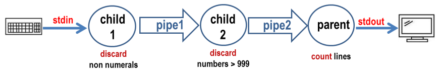

# pipe-project
An application consisting of 3 processes that share the same program and communicate through 2 pipes. 

## Information

(1) the process child-1 reads data from standard input and writes data to pipe-1 after discarding non-numeric characters.

(2) the process child-2 reads the numeric data from pipe-1 and checks if the data is less than four digits. If so it writes the data to pipe-2.

(3) the process parent reads the data from pipe-2 and counts the number of input lines until EOF is readed. Prints the number of input lines to the stdout.

